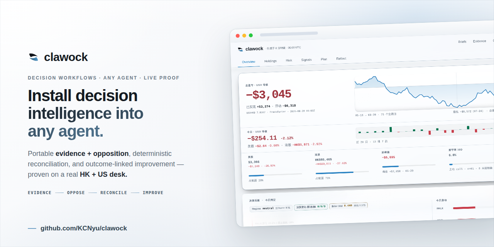
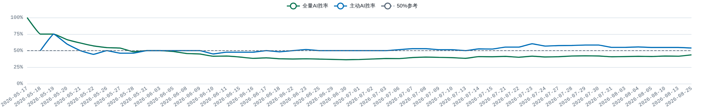

<div align="center">

<h1></h1>

### AI 争辩。代码结算。连亏损都摆在明面上。

它跑了 **<!-- CW_M:days -->106<!-- /CW_M:days --> 天**,实盘收益 **<!-- CW_M:return_pct -->−15.95%<!-- /CW_M:return_pct -->**——每一笔亏损都摊开在页面上([原始决策记录](https://github.com/KCNyu/clawock/blob/master/memory/decisions.jsonl)),账目都能从命令复算(`clawock audit-resettle` 结算决策账、`clawock reconcile` 复算组合派生)。**模型不能给自己打分**——在我们已知范围内,第一个把 AI 战绩交给代码结算的投研台。AI 建议满天飞,谁为结果负责?代码负责。

8 层 41 模块信息流 · 多 Agent 辩论 · Python 确定性结算,打包成 `pip install clawock`,装进任何 Agent(Claude Code / Codex / OpenClaw / DeepSeek Harness)。不跟单、不代下单。

[](https://pypi.org/project/clawock/)
[](https://www.npmjs.com/package/clawock-dsh)
[](https://github.com/KCNyu/clawock/actions/workflows/harness-regression.yml)
[](https://github.com/KCNyu/clawock/actions/workflows/dashboard-artifact-gate.yml)
[](https://github.com/KCNyu/clawock/actions/workflows/harness-regression.yml)
[](LICENSE)

[**实时仪表盘**](https://kcnyu.github.io/clawock/) &nbsp;·&nbsp; [**每日简报**](https://kcnyu.github.io/clawock/briefs.html) &nbsp;·&nbsp; [**证据与反证**](https://kcnyu.github.io/clawock/evidence.html) &nbsp;·&nbsp; [**English**](README.md)

<br>

<a href="https://kcnyu.github.io/clawock/">
  
</a>

<sub><i>“市场不在乎模型有多自信。”</i></sub>

<a href="https://kcnyu.github.io/clawock/"></a>

<sub>真实持仓、真实盈亏、公开打分。预览图每周刷新;实时仪表盘随交易日更新。</sub>

</div>

---

## 这是什么

clawock 是一套真实港美股账户上运行的 AI 投研系统,解决一个问题:**AI 建议满天飞,谁为结果负责?** 它让模型提议、Python 结算、战绩全公开——模型永远不能给自己打分。卖点不是「赚得更多」,而是「骗不了人」。打包成 `pip install clawock`,装进任何 Agent(Claude Code、Codex、OpenClaw、DeepSeek Harness 都行)。

每天 08:00 它读完 8 层 41 模块的信息流,组织一场多 Agent 辩论(四视角分析师 + 多空对立 + 裁判归因)给出决策;Python 独立结算,战绩连亏损都公开。不跟单、不代下单。

## 怎么跑的

大白话版:每天早 8 点,它把新闻、财报、公告全读一遍,让四个 AI 先吵一架,再让一个裁判拍板,最后自动记账。想赖账?代码不答应。

正经版:LLM 从不自己抓数据,也不自己结算。它只做一件事:**读一份 Python 组装好的上下文文件,写一份带证据、带反方的分析**。剩下全是代码的事。


```
数据源
  ──► preflight(Python,确定性)
  ──► context.json(带指纹)
  ──► LLM 读文件写分析
  ──► postflight(Python 校验)
  ──► 发布
```

## 信息层

仓库编录了 **8 层、41 个抓取与计算模块**,港股美股双语覆盖:

<details>
<summary><b>全部 8 层,逐行展开</b> —— 模块数与主要来源</summary>

<br>

| 层 | 模块 | 主要来源 |
|---|---|---|
| 1 · 行情 | 7 | 腾讯 · Yahoo · 东财 · Polygon |
| 2 · 基本面/申报 | 3 | SEC EDGAR · 东财 datacenter · 港交所 |
| 3 · 资金面 | 1 | 东财 push2his |
| 4 · 消息面与催化剂(双语) | 5 | 东财 · Finnhub · Google News · 交易所公告 |
| 5 · 宏观/情绪 | 3 | Yahoo · Reddit · CNN · 社交 feed |
| 6 · 量化与风险 | 9 | 对价格历史做确定性计算 |
| 7 · 账本/汇率校验 | 6 | Frankfurter · 对账账本 · 本地不变量 |
| 8 · 回测/自省 | 7 | 本地快照 + 基准行情 |

抓取层优雅降级:东财统一走节流网关,报价/汇率多源兜底,抓空保留旧值。41 个模块的命令清单(`analyze-hk` `us-quotes` `filings` `fundflow` `em-news` `macro` `quant` `fx` `shadow` `evaluate-*` 等)由[命令参考](docs/reference/commands.md)按 registry 生成——上面的表格与清单由 CI 对着 [`config/information-layers.json`](config/information-layers.json) 核对,模块搬了家,数字不会留在原地。

</details>

### 热点捕获:影响者雷达

系统按美股/港股时段每天 1–2 次扫描(周一至五 UTC 12:50、周日至四 UTC 21:40)**特朗普(Truth Social 一手源)、马斯克(新闻聚合)**等影响者的公开动态,LLM 过滤后自动关联持仓与板块:标出立场(endorse / oppose)、相关度,并生成中文摘要。谁说了什么、和你的持仓有没有关系,盘前简报里直接可见——不用自己刷社交媒体。

例:2026-08-13 特朗普宣布 de minimis 免税漏洞案胜诉,雷达自动命中零售/电商板块并关联到恒生科技持仓,摘要进次日盘前简报;**8-14 那次扫描 3 条动态零持仓命中(held_hits=0),简报记空**——命中或落空都照实进简报,这里展示的只是一次命中。

## 怎么做决策

分析最终落成明确的、带闸门的策略决策 —— 而同一只股票可以同时挂好几条,每条在自己的案例里独立打分:

| 策略 | 干什么 |
|---|---|
| `core_position` | 长线核心仓位 |
| `risk_rebalance` | 风控再平衡:降杠杆、止损、换仓 |
| `intraday_t` | 日内 T+0 |
| `event_trade` | 事件驱动(财报、催化剂) |
| `tactical_entry` | 战术建仓 |

加仓不是拍脑袋:量化因子与同行残差合并为一个 price_relative 证据族,时点新闻 surprise/attention 构成另一个证据族,**两族必须同时成立**;负面信息优先阻断;未验证信号只能进有上限的试探仓位,永远不能直接进决策。

### 每种运行实际拿到什么

盘前拿到的最多:持仓真值、风控、量化信号、新闻/催化剂、论点登记册、历史
复盘,还要写当日计划。开/午/收报告轻装上阵:一份新鲜行情,信号触发才带
风控段。盘中盯盘(开市每 30 分钟一次)居中:信号更细,但不产研究、不重建
证据图——那是日度产物,盘中重建等于用旧数据。

<details>
<summary><b>逐块拆解</b> —— 按频次分行对照</summary>

<br>

| | 盘前深度简报 | 开 / 午 / 收报告 | 盘中盯盘 |
|---|---|---|---|
| **什么时候** | 工作日 08:00 HKT | 港 09:30·12:00·13:30·16:00,美开收 | 开市每 30 分钟 |
| **块数** | 37 | 16 | 29 |
| **核心内容** | 持仓真值、风控、量化信号、新闻/催化剂、论点登记册、历史复盘、当日计划 | 新鲜行情、异动催化探针、待成交决策 | 行情、信号计数、T+0 牌面、异动标记、盘中重跑的入场 setup |

催化探针只对已经异动的票触发,一手源优先(SEC 受理时间戳、港交所公告),找不到就明写 `no_recent_filing`,不让空块读成「什么都没发生」。

</details>

## 辩论

**全员一致不是共识,而是警示信号。** 两名研究员各自举证、记录真实分歧——如果所有声音都同意,结论不是被采信,而是带着警示进裁判复审。所以你看不到"全员看多"的假共识。

每天 08:00,一份证据包喂给**四位分析师**(基本面 / 技术面 / 情绪面 / 板块轮动)读同一份上下文;**两名研究员必须建立多空对立论点**并记录分歧;激进 / 保守 / 中性**三位风险官**各陈其词;一位**裁判**点名策略框架,收敛成 `plan.json` 进入打分流水线(改编自 [TradingAgents](https://github.com/TauricResearch/TradingAgents))。


## 公开战绩

<sub><i>“市场不在乎模型有多自信。”</i></sub>

截至 <!-- CW_M:as_of -->2026-08<!-- /CW_M:as_of -->,这个投研台已经公开结算了 **<!-- CW_M:settled -->178<!-- /CW_M:settled --> 条判断**,Python 独立打分:

| 组 | 方向命中率 | 样本 |
|---|---|---|
| 主动建议(cut / trim / 加仓) | <!-- CW_M:active_pct -->55%<!-- /CW_M:active_pct --> | n=<!-- CW_M:active_n -->73<!-- /CW_M:active_n --> |
| 只是躺着 hold | <!-- CW_M:hold_pct -->33%<!-- /CW_M:hold_pct --> | n=<!-- CW_M:hold_n -->105<!-- /CW_M:hold_n --> |
| 高信心主动判断 | <!-- CW_M:hi_pct -->58%<!-- /CW_M:hi_pct --> | n=<!-- CW_M:hi_n -->33<!-- /CW_M:hi_n --> |

翻译成人话:**每 10 次主动判断,对 5 次半——跟抛硬币差不多,连作者都承认。** 所以它只敢吹「不骗你」,不敢吹「赚多少」。

方向命中率 ≠ 赚到钱:真实账户收益自公开以来为负(数字见下方「四条线」表,由脚本刷新),收益对比买入持有仍然落后;影子组合(模拟,非实盘)的对比在[持仓页](https://kcnyu.github.io/clawock/#drill)如实展示。[**原始账本全部公开,欢迎查账。**](https://github.com/KCNyu/clawock/blob/master/memory/decisions.jsonl)

**查账不是读文档,战绩可以复算:** `clawock audit-resettle` 重新结算整本决策账(默认不写入)、`clawock reconcile` 复算全部组合派生、`clawock integrity` 校验资金与行情不变量。判定规则(什么是 win / loss、怎么归组、怎么处理缺数据)全部在代码里版本化,**对不上算我们输**——README 上每个数字,都能从命令跑出来。四个口径互不换算:别拿方向命中率去算账户收益,也别拿账本行数当已结算数。

**四条线,各算各的:**

| 线 | 数字 | 口径 |
|---|---|---|
| **决策账本** | <!-- CW_M:rows -->691<!-- /CW_M:rows --> 条记录 → **<!-- CW_M:settled -->178<!-- /CW_M:settled -->** 个已结算案例 | 含重申归组,同一论点重复喊单只算一次;全部公开 |
| **方向命中率** | 主动 **<!-- CW_M:active_pct -->55%<!-- /CW_M:active_pct -->**(n=<!-- CW_M:active_n -->73<!-- /CW_M:active_n -->) | 模型判断的方向对不对,按基准行情结算——**与盈亏无关** |
| **影子组合**(模拟,非实盘) | 跟随建议 vs 买入持有 | 同一时间线、同日收盘计价回放,见[持仓页](https://kcnyu.github.io/clawock/#drill) |
| **真实账户** | 收益 **<!-- CW_M:return_pct -->−15.95%<!-- /CW_M:return_pct -->**(实盘,已实现 + 浮动) | 决策执行:followed <!-- CW_M:followed -->344<!-- /CW_M:followed --> / not_followed <!-- CW_M:not_followed -->307<!-- /CW_M:not_followed --> 条 |

**谁决定跟进?账户所有者。** 每条跟进/不跟进都有记录与来源;在跟进规则集公开审计之前,请把账户收益当作**人机混合的成绩**,而不是模型单独的成绩——这一点我们明说,不藏。

**账本长什么样**(真实记录,dec-5227ea7f77a2 · 2026-08-10):

```
action: hold_and_watch        driven_by: catalyst
episode: ep-20260731-spcx-hold
evaluation: loss(按基准行情结算, trigger session 2026-08-10)
```

<!-- CW_M:rows -->691<!-- /CW_M:rows --> 条这样的记录全部公开。**每条建议都带执行状态**(followed <!-- CW_M:followed -->344<!-- /CW_M:followed --> / not_followed <!-- CW_M:not_followed -->307<!-- /CW_M:not_followed --> / unknown <!-- CW_M:unknown -->40<!-- /CW_M:unknown -->);影子组合用模拟成交回放,专门暴露「建议 → 成交」的配对差距,而不是藏起来。

命中率 = 模型判断的方向对不对(按基准行情结算);账户收益 = 实盘执行结果。两回事,都公开。

## 测了什么，什么没通过

诚实到数字层面:主动建议 <!-- CW_M:active_pct -->55%<!-- /CW_M:active_pct --> 命中率,样本 <!-- CW_M:active_n -->73<!-- /CW_M:active_n --> 条,95% 置信区间约 <!-- CW_M:active_ci -->44%–66%<!-- /CW_M:active_ci -->;高信心组 <!-- CW_M:hi_pct -->58%<!-- /CW_M:hi_pct -->,样本 <!-- CW_M:hi_n -->33<!-- /CW_M:hi_n --> 条,区间约 <!-- CW_M:hi_ci -->41%–75%<!-- /CW_M:hi_ci -->——**点估计均跨过 50%,但 95% 置信区间包含 50%,统计上还不能算优势**。这正是我们不做收益宣传的原因:该是噪声的地方,就标成噪声——而分辨「edge 还是手痒」,就是这套系统唯一在卖的东西:它不替你赚钱,它替你证明每一笔判断值不值得信。

杠杆刻度盘按样本外打分,择时能力对照环形位移原假设;**当前结论:不可与随机区分,页面如实写着**。「未能拒绝原假设」不等于「已被证伪」,页面会说清楚是哪一种。结果不管好看不好看都发,页面从产物生成,不能与产物脱节;引用回测数字必须指向仍含该数字的运行卡,CI 两条都查。

[**证据与反证**](https://kcnyu.github.io/clawock/evidence.html)

## 代码强制执行的规矩

这 12 条就一个意思:**分数不是模型自己打的,账也不是模型自己记的。**两种货币
不直接相加、风控上限每份简报都核查(单一标的 ≤35%、Top-2 ≤70%、组合 β
≤3.0、−18% 止损)、论点只在有新证据时变,价格波动动不了这条。

<details>
<summary><b>全部 12 条,代码具体做什么</b></summary>

<br>

| 规矩 | 代码做的事 |
|---|---|
| **两种货币不直接相加** | 港币与美元同时以两种口径展示,并盖上汇率+时间戳;把两种货币生硬相加是个没意义的数。 |
| **风控上限,每份简报都核查** | 单一标的 ≤35%、Top-2 ≤70%、杠杆 ETF 仓位 ≤50%、组合 β ≤3.0、−18% 止损。每条 breach 都有持久化的年龄、确认、限时 override 与成交证据;回到合规前冻结同风险增仓。执行仍然是人。 |
| **集中度按腿计算** | 每本账 `HHI = Σ wᵢ²`:`<0.15` ✅ · `0.15–0.25` 🟡 · `0.25–0.40` 🟠 · `>0.40` 🔴。绝不跨币种混算。 |
| **杠杆按 regime 拨挡** | 200 日趋势 × 波动率的拨盘给杠杆 ETF 仓位封顶(×1 / ×0.5 / ×0);每日重置的 2×/3× 产品完全跳过基本面。 |
| **回报基于峰值本金** | 回报率用现金流账本里的峰值净投入,而不是 `成本 − 已实现` —— 一笔已实现盈利不该伪造出更高的回报。 |
| **软情绪不能单独翻转交易** | 一条推文或单一情绪只能微调置信度;source-weighted attention 只有同时满足自身历史加速和 price-relative 强度时,才可进入有上限的试探。硬的、带日期的负面催化仍可直接触发防守动作。 |
| **未验证信号只能进入试探边界** | 量化因子在通过前瞻激活前不能声称已验证;热身阶段只有预注册交互可以按标的/策略版本采一批有上限的样本,账本单独标注证据等级。 |
| **加仓必须有量化 × 信息交互** | 因子和同行残差只算一个 price-relative 证据族,不得冒充两票;还要有独立的时点新闻 surprise/attention 证据族才产生试探或已验证批次,技术价位只安排已经授权的资金。 |
| **对外研究里的数字必须两源** | 长文里的数字带来源清单(provenance manifest):精确 Decimal 运算、每个数字两个独立来源、tolerance 上限不能由清单自己抬高。单源或两源不一致的数字,直接卡住引用它的产物准出。 |
| **论点只在有新证据时变** | 假设、红线、估值锚都落在带版本的 JSON 里。某个维度要变,必须有上次检查之后观察到的证据;价格波动只能改估值,动不了生意 / 护城河 / 管理层;红线的触发**和**解除都要证据。没有基线就诚实记 `unknown`,不靠文案补造历史。 |
| **盈利质量由代码算,不靠断言** | 现金转化、营运资本缺口、摊薄、SBC 占比、指引结果都由代码从至少四个可比期算出。中途换会计基准或币种直接判错,缺输入就写 `unavailable` 并给原因,脚注类结论必须有一手发行人文件。 |
| **新标的先过研究闸再花深研** | 信息丰富度与投资质量分开打分,所以来源单薄只会得到 `gray_needs_evidence`(证据不足·灰),不会被判死。四条硬否决在任何计分之前结算,行业例外按板块写进配置而不是临场发挥,行情只认工作区自己的取价链。 |

</details>

## 每日节奏

```
凌晨    记忆「做梦」—— 把昨天的教训提炼进长期笔记
早上    深度简报 —— 多层辩论 + 一位裁判,推送到微信
港股    开盘 → 定时盘中监控 → 收盘
美股    开盘 → 拆分盘中监控 → 收盘
             ↑ 每次成功的播报都会发布仪表盘变更
穿插    盘前宏观 / 情绪 / 事件扫描,再加一份美股盘前新闻摘要
每周    归档、体检、复盘与视觉刷新任务
```

港股时间按 HKT;美股场次时间按 ET,其 cron 表达式随纽约夏令时自动切换。节假日 + 周末闸门跳过休市场次。精确的生成表见 [docs/operations/cron-schedules.md](docs/operations/cron-schedules.md)。

## 在你自己的账本上跑

**甩给 AI(默认):** 把本仓库地址丢给你的 Agent(Claude Code / Codex / OpenClaw / DeepSeek Harness 都行),约 60 秒就能验证一条完整决策(真实决策另需你自己的模型 API):

1. `python -m pip install clawock`
2. 跑 `bash examples/cli/minimal-run/run.sh` 验证一条完整决策(无模型,不联网)
3. 走真实决策时按 [`examples/dsh/packages/clawock-dsh/skills/investment-decision/SKILL.md`](examples/dsh/packages/clawock-dsh/skills/investment-decision/SKILL.md) 的三步流程:prepare → 写 `decision.json` → publish

**或者手动:** Python ≥ 3.11,然后:

```bash
python -m pip install clawock
clawock workflow install investment-decision --workspace ./my-decision
clawock init ./my-decision --workflow investment-decision
clawock run prepare --workspace ./my-decision
```

`run prepare` 产出一份带指纹的请求文件,你的 Agent 写出 `decision.json`,`run publish` 校验(证据、反方、资金与汇率对账)并给出生成回执。

**一条命令看完整闭环**(无模型、不联网,跑完你会看到):

```
$ bash examples/cli/minimal-run/run.sh
==> installing into a clean virtualenv
==> clawock init
initialized clawock workspace: .../book
==> clawock run prepare
==> clawock run publish
==> checking the receipt
isolated run published 9c07e83a19b046b089f443829eb9a06e
```

跑完你就拿到了第一张被 Python 校验过的决策回执。换 harness?[`examples/`](examples/README.md) 五种跑法同一条契约。

### 同一份契约,换个 harness 长得完全不一样

两个 harness、两种完全不同的界面,两边跑出来都是同一份 `decision.json`。
Claude Code 是终端里的一个循环——prepare、读、写、publish:

<p align="center"></p>

DeepSeek Harness 则是原生面板:一条命令装插件(skill + 会话面板,已发布 npm):

```bash
dsh plugin --profile web add clawock-dsh
```

**Decision Mind** tab 只有一个视图:主轴是真实成交(`portfolio.json` trades),
每行挂接软配对的决策(±3 天,来自 `decisions.jsonl`)作为「当时为什么」,
卖出单用 T+1 快照收盘价判定卖飞/卖对。点开一条成交,展开成
**计划 → 执行 → T+1 → 盈亏** 的纵向时间线,为什么(rationale)和备注用语义色
左边框分层;情绪压力字段也在,但目前只有极少数记录填过,不是每条都有。
没有决策的成交显式标注「无关联决策记录」——不假装有判断。
币种绝不混加:USD/HKD 分开,只经桌面发布的汇率折算。
同一份轨迹数据也渲染在公开 dashboard 的 Reflect 卡片——插件和网页
同一个数据契约:

<p align="center"></p>

对话判定落账:任何 harness 都走同一条命令
`clawock record --source <harness>`(bear 与失效条件强制、情绪自认)。
没有人手改 `decisions.jsonl` —— 一个账本、一条命令、每个 harness 自己调。

**装完你得到三件事:** ① 每天 08:00 微信一份带证据链的深度简报,盘中每 30 分钟轻量盯盘(可关);② 一套所有决策可复算、可查账的审计框架;③ 一个诚实的基线——以后任何策略、任何 Agent,都能拿它跟 90 天实盘记录对比。它现在不能承诺「赚」,能承诺的是「每一笔都有据可查」。模型费用走你自己的 API key,clawock 本身免费开源。

## 逛一逛这套系统

- [**实时仪表盘**](https://kcnyu.github.io/clawock/) —— 持仓、风控,以及自评战绩。
- [**每日简报**](https://kcnyu.github.io/clawock/briefs.html) —— 已发布的早读。
- [**排程表**](docs/operations/cron-schedules.md) —— 生成的 cron 表。
- [**命令参考**](docs/reference/commands.md) —— 全部 installed command(清单由 registry 生成)+ 手写的 provider 与 harness 细节。
- [**项目文档**](docs/README.md) —— 运维、参考、法律说明与历史设计。

### 研究入口

| 问题 | 入口 | 复用范围 |
|---|---|---|
| 分析一家美股公司 | [`us-stock-analysis`](skills/us-stock-analysis/SKILL.md) | 可随 clawock 工作区复用 |
| 分析一家港股公司 | [`hk-stock-analysis`](skills/hk-stock-analysis/SKILL.md) | 可随 clawock 工作区复用 |
| 检查当前组合 | [`portfolio-risk-review`](skills/portfolio-risk-review/SKILL.md) / [`portfolio-swarm-review`](skills/portfolio-swarm-review/SKILL.md) | 依赖已配置的真实组合 |
| 压测一条供应链论点 | [`serenity-skill`](skills/serenity-skill/SKILL.md) | 可作为手动研究框架复用 |
| 复盘一个已披露的报告期 | [`earnings-review`](skills/earnings-review/SKILL.md) | 可复用,产物落 `memory/earnings/` |
| 判断一个新标的值不值得做深度研究 | [`entry-gate`](skills/entry-gate/SKILL.md) | 可复用,产物落 `memory/entry-gates/` |

串联顺序:建仓前研究闸 → 一手财报证据 → 规范论点 → 决策 / 风控 / 结算回路。每一步写带版本的产物给下一步读,后一步永远无法用文案重推前一步。

<details>
<summary><b>战绩怎么打分(硬规则)</b></summary>

<br>

<p align="center"></p>

<sub>累计案例胜率对 50% 方向命中基线 —— 衡量方向对了多少次,不是赚了多少;买入持有对比在持仓页的影子组合里。每周刷新。</sub>

- 触发与标记来自单一基准供应商的逐日不复权行情;未完成场次永不打分,缺口按开盘价成交
- 置信度只保留为审计字段;严格前向的 beta-binomial 分层模型,稀疏小组向宽层先验收缩
- 择时单独计价:只问触发成交比当日收盘好或差多少,从不画累计金额曲线
- 影子组合(模拟,非实盘):两本现金+库存账重放同一时间线,一本跟主动建议、一本买入持有
- 页面从产物生成,不能与产物脱节;引用回测数字必须指向仍含该数字的运行卡,CI 两条都查

</details>

<details>
<summary><b>工程细节:架构与写入协调</b></summary>

<br>


- 仪表盘产物整体发布到数据面(data plane);前端直接读扫描旁路文件(sidecar),写者互不冲突
- 所有写入走 `ops/publish/safe_push.sh`:rebase 重试、真冲突中止,冲突标记在 push hook 被拒
- `portfolio.json` 是唯一真源:advisory 文件锁 + 原子替换,pre-push hook 拦下账目不平的 push
- 模型选择属于外部 runtime,仓库不存任何供应商密钥
- 仓库结构、排程契约等细节见[项目文档](docs/README.md)

</details>

<details>
<summary><b>仓库结构</b></summary>

<br>

| 路径 | 所有权 |
|---|---|
| `src/clawock/` | 可移植包、工作流契约、schema 与 CLI |
| `config/profiles/` | 只含数值和资源引用的声明式 desk profile |
| `site/` | Jekyll/仪表盘源码、浏览器代码、SVG、截图与 social 资产 |
| `ops/{host,publish,ci,growth,pages}/` | 明确归属的 host、发布、CI、增长与 Pages 接线;不允许通用数据桶 |
| `docs/`、`tests/` | 产品/运维文档与高价值不变量检查 |
| 根上下文文件、`skills/`、`memory/` | OpenClaw 兼容面;保留在运行时要求的位置 |
| `portfolio.json`、`assets/data/` | live 账本与生成发布状态;永不进入包 |
| `LICENSE`、`NOTICE`、`THIRD_PARTY_LICENSES/` | 标准 legal/包入口,由 Pages staging 复制 |

</details>

## 范围、免责与许可

**为什么要开源、图什么:** 这套系统本来就在跑——这是作者自己的真实账户,亏盈都是自己的钱。开源是把账本和流程摊开,不收费、无付费版、无荐股群;你装不装、跟不跟,和作者的收入没有任何关系。

本仓库包含**真实交易持仓**,是个人记录与可携带工作区——**不是投资建议、不是推荐、也不是跟单系统**。结算规则与方法学变更都在代码里版本化,任何一条结果都不是人工挑选的;主动建议至今没显出优势,你读到时每个数字都可能已经过时。

原创代码 [MIT](LICENSE);改编第三方代码保留原许可与署名,见 [NOTICE](NOTICE) 与 [`THIRD_PARTY_LICENSES/`](THIRD_PARTY_LICENSES/)。行情、新闻、社交内容与 API 访问**不**被 MIT 重新授权,见[第三方数据与服务](docs/legal/third-party-data.md)。

用 [Claude Code](https://claude.com/claude-code)、[openclaw](https://openclaw.com) cron 守护进程、Jekyll + GitHub Pages 与 Python 构建。

<div align="center">
<br>

**[实时仪表盘](https://kcnyu.github.io/clawock/)** &nbsp;·&nbsp; **[每日简报](https://kcnyu.github.io/clawock/briefs.html)** &nbsp;·&nbsp; **[English](README.md)**

<sub>由 <a href="https://github.com/KCNyu">Shengyu Li (kcn)</a> 与 Rick 构建维护 · 2026</sub>

</div>
